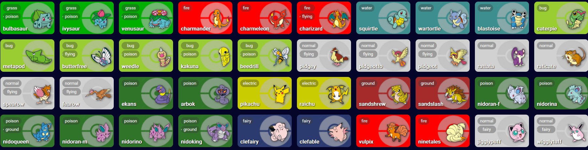

<h1>Pokédex</h1>
    
Pokédex com 600 exemplares de pokémons
 
    

<h2>instalação</h2>
    
basta acessar esse <a href="https://danilobserafim.github.io/pokedex">link</a>

<h2>Modo de uso</h2>
    
Acessar páginas 
 
• visão geral  
&nbsp lista a versão oficial da "The pokemon company" 
 
• visão em características: lista os pokémons por ordem de tipo 
&nbsp o titulo já é bem descritivo

<h2>Técnologias</h2>
    
• HTML5 
• CSS 
• JAVASCRIPT

    

<h2>Licença</h2>
    
ISC

<h2>Créditos</h2>
    
Danilo Barbosa Serafim 
Desenvolvedor de software 
• <a href="https://github.com/danilobserafim">Github</a> 
• <a href="https://www.linkedin.com/in/danilobserafim/">Linkedin</a>

    